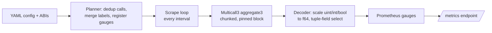

# evm-contract-exporter

A Prometheus exporter that batch-reads `view`/`pure` functions from EVM smart
contracts via [Multicall3](https://github.com/mds1/multicall) and exposes their
return values as gauges. Point it at an RPC endpoint and a YAML config that maps
contracts, functions, and outputs to metrics; every scrape interval it pins a
block, batches all configured calls into `aggregate3` requests, decodes the
numeric/boolean results, and serves them at `/metrics`.

## How it works



## Install / Run

Build the release binary:

```bash
cargo build --release
```

Run against an RPC endpoint (the config reads `${ETH_RPC_URL}` from the
environment):

```bash
ETH_RPC_URL=https://eth.llamarpc.com \
  ./target/release/evm-contract-exporter --config examples/chainlink-eth-usd.yaml
```

Then scrape it:

```bash
curl -s localhost:9100/metrics | grep -E '^(evm_exporter_|chainlink_eth_usd_)'
```

Validate a config without serving (parses YAML, resolves ABIs, checks function
names/arg types, then probes the chain for `eth_chainId` match and that the
configured `block_tag` resolves to a real block):

```bash
ETH_RPC_URL=https://eth.llamarpc.com \
  ./target/release/evm-contract-exporter --config examples/chainlink-eth-usd.yaml --validate-only
```

### CLI flags

| Flag | Default | Purpose |
|---|---|---|
| `--config <path>` | _(required)_ | Path to the YAML config file. |
| `--log-level <level>` | `info` | `trace`, `debug`, `info`, `warn`, `error`. |
| `--log-format <fmt>` | `json` | `json` or `text`. |
| `--validate-only` | `false` | Validate config (incl. live RPC probes) and exit. |

## Configuration reference

A config has five top-level sections. Unknown fields are rejected. `${NAME}`
references in any string are expanded from the environment (braced form only;
bare `$NAME` is left untouched).

### `chain`

| Field | Default | Purpose |
|---|---|---|
| `rpc_url` | _(required)_ | EVM JSON-RPC endpoint. Usually `${ETH_RPC_URL}`. |
| `chain_id` | _(required)_ | Expected chain ID; verified against `eth_chainId` at startup. |
| `multicall3_address` | `0xcA11bde05977b3631167028862bE2a173976CA11` | Multicall3 deployment address. |
| `block_tag` | `finalized` | Block to pin each scrape to: `latest`, `safe`, or `finalized`. |
| `request_timeout` | `10s` | Per-RPC-request timeout. |

### `server`

| Field | Default | Purpose |
|---|---|---|
| `listen_address` | `0.0.0.0:9100` | HTTP listen address. |
| `metrics_path` | `/metrics` | Prometheus metrics path. |
| `health_path` | `/healthz` | Health-check path (200 while the server is up). |

### `scrape`

| Field | Default | Purpose |
|---|---|---|
| `interval` | `30s` | Time between scrapes. |
| `timeout` | `25s` | Per-scrape deadline; overlapping scrapes are skipped. |
| `max_calls_per_batch` | `500` | Max calls per `aggregate3` chunk. |

### `labels`

A map of constant labels applied to every metric (and as const labels on the
`evm_exporter_*` self-metrics). Merged with contract/instance/call labels;
more-specific levels win. `address` and `chain_id` are reserved.

### `contracts[]`

| Field | Default | Purpose |
|---|---|---|
| `name` | _(required)_ | Logical contract name. Used as the metric prefix unless `metric_prefix` is set. |
| `metric_prefix` | `name` | Prometheus metric name prefix for this contract. |
| `abi_path` | — | Path to a JSON ABI file. Mutually exclusive with `abi_inline`. |
| `abi_inline` | — | Inline JSON ABI string. Mutually exclusive with `abi_path`. |
| `labels` | `{}` | Labels applied to all of this contract's metrics. |
| `instances[]` | `[]` | Addresses to read this contract at. |
| `metrics[]` | `[]` | Functions to read. |

#### `contracts[].instances[]`

| Field | Purpose |
|---|---|
| `address` | Contract address (emitted as the lowercase-hex `address` label). |
| `labels` | Labels applied to metrics for this instance. |

#### `contracts[].metrics[]`

| Field | Purpose |
|---|---|
| `name` | Override the inferred metric name (rare; usually inferred). |
| `help` | `HELP` text for the gauge. |
| `function` | View/pure function to call. |
| `args` | Function arguments (for functions that take inputs). |
| `outputs[]` | Which return values to emit (see below). Omit for single-output functions. |
| `calls[]` | Emit the same function with multiple arg sets; each entry has its own `args` + `labels`. |
| `labels` | Labels applied to this metric. |

#### `contracts[].metrics[].outputs[]`

| Field | Default | Purpose |
|---|---|---|
| `index` | `0` | Index into the function's return tuple. |
| `field` | — | For a struct/tuple return, the field name to select. |
| `name` | — | Suffix appended to the metric name for this output. |
| `scale` | `1` | Divide the raw integer by this before emitting (e.g. `1e8` for 8-decimal feeds). |

See [`examples/chainlink-eth-usd.yaml`](examples/chainlink-eth-usd.yaml) for a
complete, runnable example using the public Chainlink ETH/USD feed.

## Metric naming

Metric names are `snake_case`, built from the (effective) metric prefix plus
the function and output names:

- Function and output names are converted with an acronym-aware
  `camelCase → snake_case` (e.g. `APIKey → api_key`, `feeAPR → fee_apr`,
  `latestRoundData → latest_round_data`).
- **Single-output** functions emit `<prefix>_<function>` (e.g.
  `chainlink_eth_usd_decimals`).
- **Multi-output** functions emit `<prefix>_<function>_<output-name>` for each
  selected output (e.g. `chainlink_eth_usd_latest_round_data_answer`).
- A tuple/struct `field` selection adds the field as a suffix.

Only numeric and boolean scalar outputs are exportable; `address`/`string`/
`bytes` and nested composite returns are rejected at validation time. Large
`uint256`/`int256` values are scaled to `f64`; values exceeding the supported
decimal precision still emit a gauge but are flagged with a `precision_loss`
warning (logged once per metric+address).

## Self-metrics

The exporter exposes its own observability metrics. Top-level `labels` are
attached to each as constant labels.

| Metric | Type | Labels | Meaning |
|---|---|---|---|
| `evm_exporter_scrape_duration_seconds` | gauge | — | Duration of the last scrape. |
| `evm_exporter_scrape_errors_total` | counter | `reason` | Scrape-wide failures (`rpc_error`, `block_not_available`, `chunk_failed`, `timeout`). |
| `evm_exporter_call_errors_total` | counter | `contract`, `function`, `address` | Per-call decode/revert failures. |
| `evm_exporter_last_scrape_success_timestamp_seconds` | gauge | — | Unix time of the last fully-successful scrape. |
| `evm_exporter_rpc_block_number` | gauge | — | Block number the last scrape was pinned to. |
| `evm_exporter_calls_total` | counter | — | Total contract calls issued. |
| `evm_exporter_chunks_total` | counter | — | Total `aggregate3` chunks issued. |
| `evm_exporter_build_info` | gauge | `version`, `commit`, `rust_version` | Build info (always `1`). |

## Runbook

### `evm_exporter_scrape_errors_total` is rising

Scrape-wide failures — the exporter couldn't complete a batch at all.

| `reason` | Cause | First move |
|---|---|---|
| `rpc_error` | RPC call errored or timed out | Check RPC provider status / rate limits; check `ETH_RPC_URL`. |
| `block_not_available` | `eth_getBlockByNumber(block_tag)` returned null | Provider may not expose the configured `block_tag` (`finalized` often lags on some endpoints); try `safe` or `latest`. |
| `chunk_failed` | An `aggregate3` call failed mid-scrape | Usually transient; sustained failures mean the batch is too large (lower `scrape.max_calls_per_batch`) or Multicall3 isn't at the configured address for this chain. |
| `timeout` | Scrape exceeded `scrape.timeout` | Increase `scrape.timeout` or lower `scrape.max_calls_per_batch`; check RPC latency. |

All gauges retain their last-known values across scrape failures. Watch
`evm_exporter_last_scrape_success_timestamp_seconds`; if it's older than a few
intervals, alert.

### `evm_exporter_call_errors_total` is non-zero

Per-call failures — one specific view function reverted or returned
un-decodable data. Labels `contract`, `function`, `address` pin the culprit.
Rising without matching `scrape_errors_total` movement means the exporter is
healthy but a specific call is broken — investigate that contract/function,
don't page on the exporter.

### Stale metrics / values aren't updating

1. Compare `evm_exporter_rpc_block_number` to the chain's latest (or finalized)
   block. Large gap → RPC provider issue or `finalized` lag.
2. Check `evm_exporter_last_scrape_success_timestamp_seconds` — if recent,
   scrapes are succeeding and values genuinely haven't changed.
3. Check logs — every scrape emits one structured line with `block_number`,
   `duration_ms`, `call_count`, `error_count`.

## Docker / Helm

- A multi-stage [`Dockerfile`](Dockerfile) builds a minimal non-root image.
- A Helm chart lives in [`charts/evm-contract-exporter`](charts/evm-contract-exporter);
  see its README for deployment, ABI mounting, and Prometheus scrape config.

## Disclaimer

All crates in this repository are provided **as-is**, without warranty of any kind,
express or implied, including but not limited to merchantability, fitness for a
particular purpose, or non-infringement. Apyx makes no guarantees regarding
correctness, security, availability, or suitability for any use case.

By using or depending on these crates, you assume **all liability and risk**
arising from that use, including any direct or indirect damages, data loss, or
operational impact.

## License

[Apache-2.0](LICENSE).
